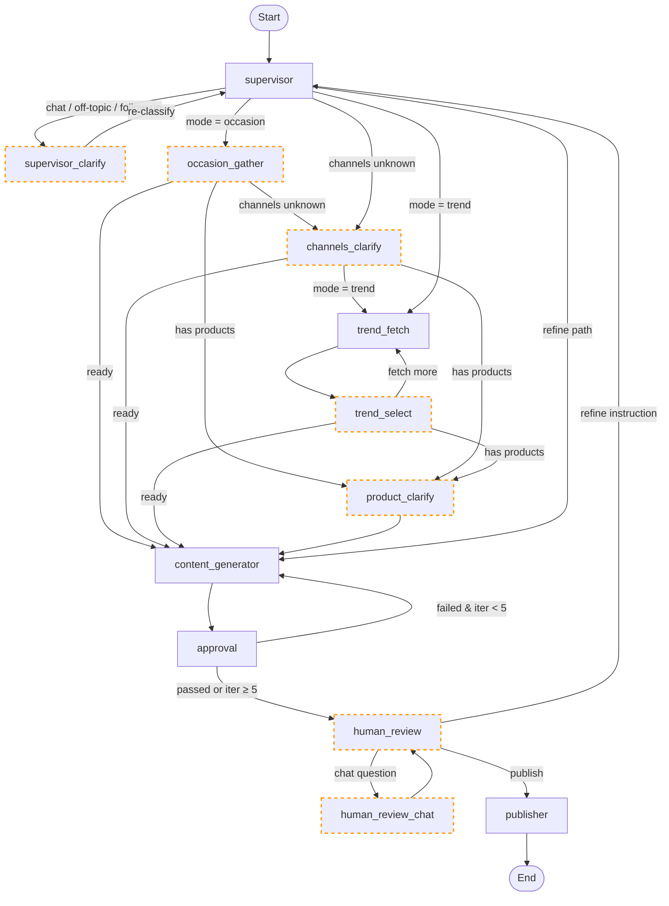

# Brand Buddy
Multi-agent AI pipeline for Instagram and email marketing automation.

---

## Live Demo

| Service | URL |
|---|---|
| Frontend | https://brandbuddy-frontend-510506868826.us-central1.run.app |

---

## Agent Architecture



Nodes with dashed orange borders pause the pipeline and surface state to the frontend. The user resumes by POSTing to `/campaign/reply`.

---

## Running Locally

### Backend

```bash
cd backend
pip install -r requirements.txt

export GOOGLE_OAUTH_CLIENT_SECRET_FILE=credentials/client_secret_<...>.json
export GOOGLE_OAUTH_REDIRECT_URI=http://localhost:8000/auth/google/callback
export JWT_SECRET_KEY=<random-string>
export GCP_PROJECT_ID=agentic-ai-dk3480
export BQ_DATASET_USERS=social_content_agent
export GCS_BUCKET_NAME=social-content-agent-assets
export FRONTEND_URL=http://localhost:3000
export OAUTHLIB_INSECURE_TRANSPORT=1   # dev only — allows HTTP OAuth

uvicorn main:app --reload
```

### Frontend (requires Node 18+)

```bash
cd frontend
npm install

export NEXT_PUBLIC_API_URL=http://localhost:8000

npm run dev   # http://localhost:3000
```

---

## Course Concepts

| Concept | Lecture | File(s) | Implementation |
|---|---|---|---|
| LangGraph StateGraph | Apr 06 | `backend/agents/graph.py` | `_build()` wires all 12 nodes into `StateGraph(GraphState)` compiled with `MemorySaver`; each `*_node()` is one iteration of the agent loop |
| Router / Orchestrator | Mar 23 | `backend/agents/supervisor.py` | `supervisor_node` classifies intent into 5 categories; `route_after_supervisor()` dispatches to the right sub-agent |
| Generator-Critic | Mar 23 | `backend/agents/content_generator.py`, `backend/agents/approval.py` | Generator produces 3 images/captions/emails; approval scores against hard-failure rules (missing logo, typos) and soft scores (pass ≥ 60); failed items get `fix_instruction` for up to 5 retries |
| Human-in-the-Loop | Mar 23 | `backend/agents/human_review.py` | `interrupt()` pauses at 3 explicit checkpoints; user resumes via `Command(resume=...)` posted to `/campaign/reply`; supports publish, refine, and inline chat |
| Context Engineering | Feb 02 | `backend/agents/supervisor.py`, `backend/agents/content_generator.py` | Brand context (name, industry, tone, colors, audience) injected as fixed f-string prefix in every prompt; all outputs use JSON-mode (`response_mime_type="application/json"`) |
| Model-as-a-Judge | Feb 09 | `backend/agents/approval.py` | `gemini-2.5-pro` evaluates images via Vision and captions/emails via text; hard failures auto-fail; aggregate score ≥ 60 required to pass |
| Context State Memory | Apr 13 | `backend/agents/state.py` | `GraphState` TypedDict with 70+ optional fields; each node reads full state and writes only its own slice |
| Persistent Memory | Apr 13 | `backend/db/bigquery.py`, `backend/db/usage.py` | BigQuery is the durable store for users, campaigns, and quota; `usage.py` adds an in-process `_usage_cache` dict for fast reads backed by BigQuery on cache miss |
| Agents as Functions | Apr 20 | `backend/routers/campaign.py` | Each agent is a pure `(state) → dict` function; campaign router exposes them as HTTP endpoints (`/campaign/start`, `/campaign/reply`); `MemorySaver` keyed by `thread_id` enables cross-request state persistence |
| Splitter + Researcher + Synthesizer | Apr 20 | `backend/agents/trend_analyzer.py` | `trend_fetch_node` uses Gemini 2.5 Pro + Google Search to discover 6 current trends; `trend_select_node` synthesizes the chosen trend into `brand_angle`, `headline`, and `visual_direction` |
| Tool Calling | Feb 16 | `backend/agents/publisher.py` | Calls Meta Graph API (create container → publish) and SendGrid as external tools; polls Instagram container status asynchronously with a 60-second deadline |
| Effort-Tiered Model Selection | Apr 27 | `backend/agents/content_generator.py` | `gemini-2.5-flash-lite` for intent classification, `gemini-2.5-flash` for image editing, `gemini-2.5-pro` for generation and evaluation |
